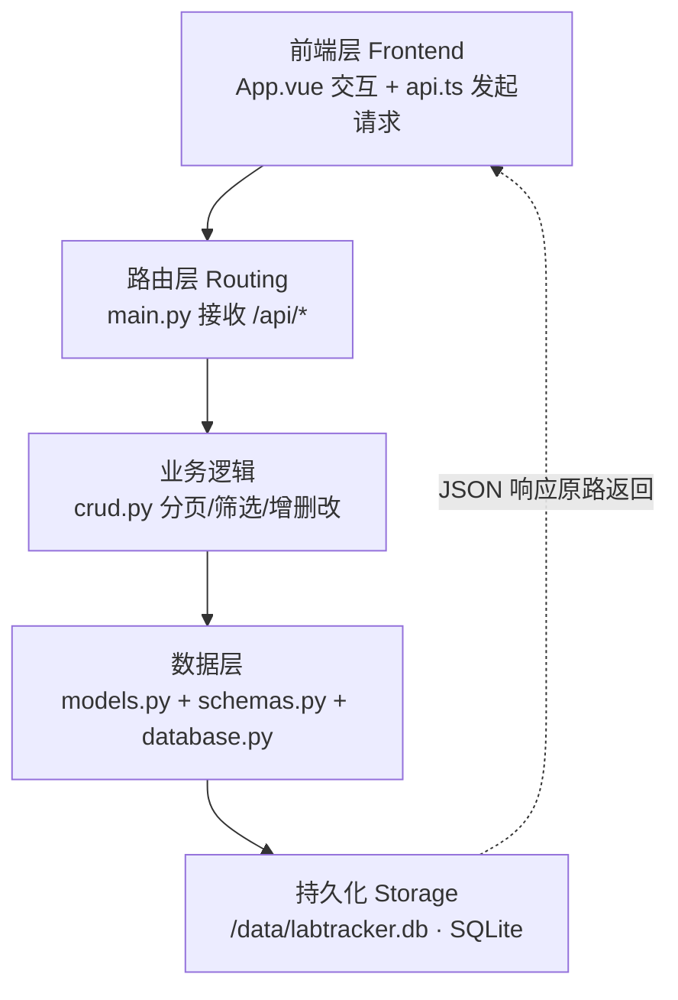

# Lab Test Tracker · 代码阅读指南

> **一句话定位**：这是一个为 UL Solutions 苏州 Software Engineer 岗（实验室运营数字化）做的技术对齐作品集。技术栈 = FastAPI(Python) 后端 + Vue3 + TypeScript 前端 + Docker + Azure。本指南帮你用最短路径读懂它。
>
> **怎么用这份指南**：先建立"一次请求怎么穿过前后端"的主线（第 0 节），再按第 1 节的顺序逐站读代码，最后用第 2 节的"对着页面读"把理论落地。不要一上来就从 `main.py` 逐行啃——先地图，后细节。

---

## 0. 核心心智模型：一次请求的生命周期

整个项目就是"一个 HTTP 请求穿过前后端再回来"的闭环。记住这条主线，后面每个文件都知道自己处在哪个位置：



**关键点**：前端永远不直接碰数据库；它只发 HTTP 请求 → 后端 `main.py` 收 → `crud.py` 处理 → 数据库读写 → JSON 返回 → 前端渲染。理解这一点，项目就没有黑盒了。

---

## 1. 阅读路线（按顺序）

### 第 0 站 · `README.md` —— 先看地图
别急着钻代码。README 写了项目是什么、技术栈、怎么本地跑、以及**它和 UL JD 的逐条映射**。看完你就知道每个文件存在的理由，再读代码不会迷路。

### 第 1 站 · 数据长什么样（静态契约）
- **`backend/app/schemas.py`** —— Pydantic 模型，是前后端之间的"合同"：
  - `TestRecordCreate`：创建记录时**必填**哪些字段
  - `TestRecordUpdate`：更新时**全部 Optional**（支持部分更新）
  - `TestRecordOut`：接口**返回**给前端长什么样
  - `FilterParams`：列表筛选/分页参数
- **`backend/app/models.py`** —— SQLAlchemy ORM 表 `TestRecord` 的字段定义。
- 👉 *盯着看*：把 `schemas.py` 和 `models.py` 对照，理解"数据库存的"和"接口传的"是两回事（ORM 对象 ↔ JSON 的双向转换）。

### 第 2 站 · 后端主线（一次请求怎么被处理）
- **`backend/app/main.py`** —— FastAPI 入口。看 `@app.get("/api/records")` 等路由怎么定义；以及 `StaticFiles` 怎么把构建好的前端 `dist/` 挂到根路径（这就是为什么一个容器能同时跑前后端）。
- **`backend/app/crud.py`** —— **核心业务逻辑，重点文件**：
  - `get_records()`：怎么用 `offset(skip).limit(limit)` 做**服务端分页**，怎么按 `keyword/status` 拼筛选条件
  - `update_record()`：怎么用 `model_dump(exclude_unset=True)` 实现**只更新前端实际传的字段**
- **`backend/app/database.py`** —— 数据库连接。注意它读了 `SQLITE_DB` 环境变量（对应 docker-compose 的卷挂载），以及 `get_db` 依赖注入。
- 👉 *盯着看*：`crud.py` 里 `get_records` 的 `skip/limit` 和 `update_record` 的 `exclude_unset` 是面试高频考点，务必读懂。

### 第 3 站 · `backend/app/seed.py` —— 造数据
生成测试记录。理解它，你就知道页面上"Seed 5000 行"按钮背后的数据从哪来。

### 第 4 站 · 前端怎么调、怎么渲染
- **`frontend/src/api.ts`** —— 前端发起请求的函数（`listRecords` / `createRecord` / `seedRecords` …），和后端路由**一一对应**。
- **`frontend/src/App.vue`** —— 主界面：表格渲染、`@input` 实时搜索、翻页按钮、Seed 按钮。看它怎么调 `api.ts`、怎么把返回的 JSON 填进表格。
- 👉 *盯着看*：前端**只渲染 20 行**（每页 `limit=20`），5000 行数据在数据库里、不在 DOM 里——这正是服务端分页的意义。

### 第 5 站 · 怎么打包部署
- **`Dockerfile`** —— 多阶段构建：前端 `node` 阶段只产出 `dist/`，后端 `python` 阶段只装运行依赖，最终镜像干净小巧。
- **`docker-compose.yml`** —— 端口映射 8000、卷挂载 `app-data`、`SQLITE_DB` 环境变量注入。
- **`azure-pipelines.yml`** + **`deploy-azure.sh`** —— 推到 Azure App Service 的 CI/CD 流程。

### 第 6 站 · `INTERVIEW_PREP.md` —— 面试官视角反查
最后读它，把前面读懂的代码用"会被怎么问"串一遍，查漏补缺。这是把"读懂"变成"能讲"的关键一步。

---

## 2. 最省力的读法：对着跑起来的页面读

你已经 `docker compose up` 跑起来了，**别纯读代码，边点页面边读**。

### 前置
```bash
# 项目根目录
docker compose up --build
# 浏览器打开 http://localhost:8000
```

### 用两个功能串起整条主线

**功能 A：点 Seed 按钮（造 5000 行）**
```
App.vue 的 Seed 按钮
  → api.ts 的 seedRecords()
  → main.py 的 POST /api/seed
  → crud.seed_records()
  → database 写入 SQLite (/data/labtracker.db)
```

**功能 B：筛选 + 翻页**
```
App.vue 输入框 (@input)
  → api.ts listRecords({ keyword, skip, limit })
  → main.py GET /api/records?keyword=...&skip=0&limit=20
  → crud.get_records() 拼 SQL 筛选 + 分页
  → 返回 JSON → 前端只渲染当前页 20 行
```

把这两个功能完整走通，整个"请求-响应"闭环你就吃透了，剩下文件都是细节填充。

---

## 3. 关键文件速查表

| 文件 | 角色 | 对应 UL JD |
|---|---|---|
| `backend/app/main.py` | 路由入口 + 托管前端静态页 | 全栈交付能力 |
| `backend/app/crud.py` | 业务逻辑（分页/筛选/CRUD） | Python 后端核心 |
| `backend/app/schemas.py` | Pydantic 请求/响应契约 | Python / TypeScript |
| `backend/app/models.py` | ORM 数据表定义 | 后端数据建模 |
| `backend/app/database.py` | SQLAlchemy 连接 + 环境变量 | 后端基础设施 |
| `backend/app/seed.py` | 测试数据生成 | 演示数据能力 |
| `frontend/src/api.ts` | 前端 HTTP 调用层 | JS/TS 前端 |
| `frontend/src/App.vue` | 主界面（表格/筛选/翻页） | Vue3 + TS |
| `Dockerfile` | 多阶段容器构建 | Docker 容器化 |
| `docker-compose.yml` | 本地编排 + 卷挂载 | Docker |
| `azure-pipelines.yml` | Azure CI/CD 流水线 | Azure / Azure DevOps |
| `deploy-azure.sh` | Azure CLI 手动部署 | Azure 云部署 |
| `INTERVIEW_PREP.md` | 面试准备手册 | 求职对齐 |

---

*这份指南和 `INTERVIEW_PREP.md` 配套使用：本文件帮你"读懂代码"，另一份帮你"讲清代码"。*
